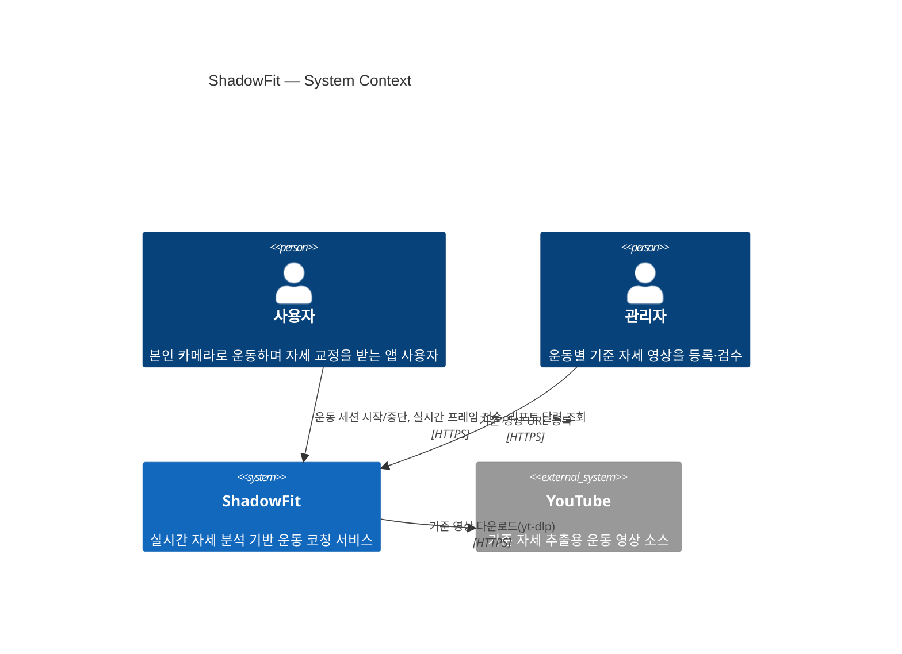
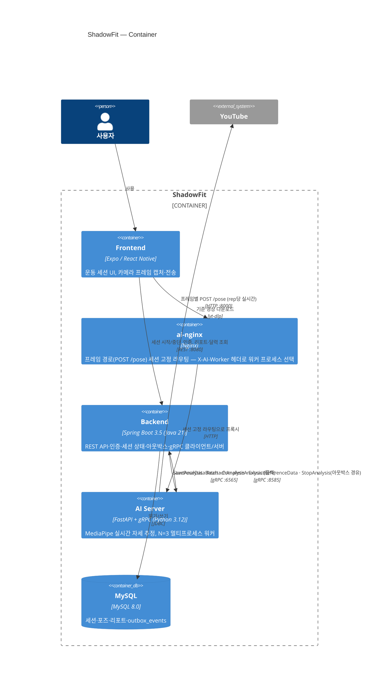

# C4 모델 — Context / Container

작성일: 2026-09-01
범위: Level 1(System Context) · Level 2(Container)까지. Component(Level 3) 레벨은 없음 — 지금은 Spring 쪽 패키지 구조([`../02-folder-structure.md`](../02-folder-structure.md))로 충분히 읽히고, 별도 다이어그램을 얹을 만큼 컨테이너 내부가 복잡해지면 그때 추가한다.
근거: [`../architecture/ai-backend-integration.md`](../architecture/ai-backend-integration.md)(§2 컴포넌트 구성 ASCII 다이어그램을 Mermaid C4로 재구성), `docker-compose.yml`, `nginx-ai/default.conf`.
형식: [Mermaid C4](https://mermaid.js.org/syntax/c4.html) — GitHub·Claude 아티팩트 모두 네이티브 렌더링.

---

## Level 1 — System Context

가장 바깥의 진짜 외부 의존은 **YouTube 하나뿐**이다. LLM 기반 리포트 문장 생성은 [`../decisions/report-generation-llm.md`](../decisions/report-generation-llm.md)에서 여전히 "설계·미결정"이라 외부 시스템으로 아직 안 그린다 — 붙는 순간 이 다이어그램도 갱신 대상.

---

## Level 2 — Container

### 이 다이어그램에서만 보이는 것

일반적인 "프론트 → 백엔드 → AI" 3계층 그림으로는 안 맞는다. **프론트는 AI 서버에도 직접 붙는다** — 세션 제어(시작/중단/리포트)는 Spring을 거치지만, **실시간 포즈 프레임(`POST /pose`)은 `ai-nginx`를 통해 AI 서버로 바로** 간다. 이유:
- 프레임은 rep마다 오는 고빈도 페이로드라 Spring을 한 번 더 거칠 이유가 없음
- 대신 AI가 세션 종료·최종 통계는 gRPC 콜백(`CompleteAnalysis`)으로 Spring에 알려야 정합성이 맞음 → **왕복 경로가 대칭이 아니다**

`ai-nginx`가 별도 컨테이너로 있는 이유도 이 프레임 경로 때문 — AI 서버가 N=3 멀티프로세스([[project_ai_ceiling_gil_n3_closed]], [`../decisions/ai-process-ceiling-cause.md`](../decisions/ai-process-ceiling-cause.md))라 Spring이 세션 시작 응답으로 알려준 `aiWorkerIndex`를 그대로 헤더로 얹어 같은 워커에 고정 라우팅해야 한다.

### 관측 스택은 뺐다

`prometheus` · `grafana` · `mysqld-exporter` · `cadvisor` · `node-exporter`는 `docker-compose.yml`에 있지만 위 다이어그램에는 넣지 않았다 — 이건 애플리케이션의 **협력 대상**이 아니라 **관측 대상**이라 C4 Container(런타임 협력 구조)보다 [`../19-deployment.md`](../19-deployment.md)·[`../../monitoring/README.md`](../../monitoring/README.md)에서 다루는 게 맞는 결.

### 최신성 책임

이 파일은 [`../architecture/README.md`](../architecture/README.md)의 갱신 트리거(§ RPC 추가/삭제, 전달 보장 변경, 컨테이너 추가/삭제)에 같이 걸린다. Container 다이어그램의 화살표 하나하나는 `../architecture/ai-backend-integration.md` §2·§3의 표를 그대로 옮긴 것이므로, 그 문서가 갱신되면 여기도 같이 봐야 한다.
